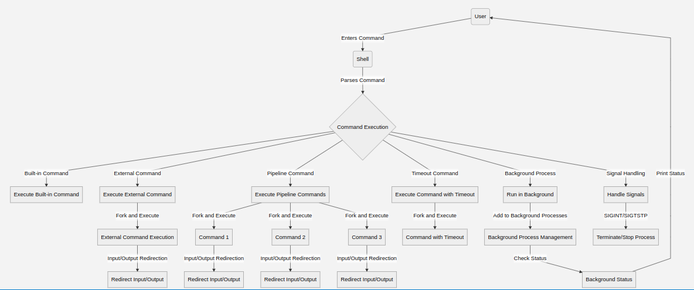

# HexShell

HexShell is a simple shell implementation in C with additional features, including background process management, input/output redirection, piping, signal handling, and a timeout command.

## Getting Started

To compile the program, run the following command in the terminal:

> gcc -o hexshell hexshell.c

To run the shell, simply execute the compiled binary:

> ./hexshell

## Design



## Features

- **Command Execution:** Execute commands entered by the user.
- **Input/Output Redirection:** Redirect standard input and output for commands.
- **Piping:** Execute commands in a pipeline.
- **Background Process Management:** Manage background processes and check their status.
- **Signal Handling:** Handle signals such as `SIGINT` (Ctrl+C) and `SIGTSTP` (Ctrl+Z).
- **Timeout Command:** Execute a command with a specified timeout.

## Shell Commands

- Background Process:
```bash
sleep 10 &
```
- Timeout Command:

```bash
timeout 5 echo "Hello, HexShell!"
```
- Pipeline:

```bash
ls -l | grep .txt
```

- Input/Output Redirection:

```bash
cat < input.txt > output.txt
```

## Signal Handling
- Ctrl+C (SIGINT): Terminates the current process.
- Ctrl+Z (SIGTSTP): Placeholder for future implementation (process suspension).

## Cleanup
- The program deallocates memory for command arguments at the end of each iteration.
- Use exit command to exit the shell.

## Future Enhancements
- Implement process suspension for SIGTSTP.
- Improve background process management (cleanup, signal handling).

The shell is intended as a basic starting point and can be extended to include additional features based on specific requirements.
